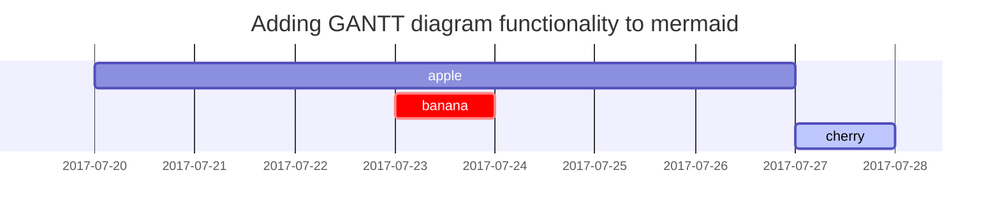

## Introduction

[Jekyll](https://jekyllrb.com) is a tool for building static websites. This
website is built using the [Jekyll Chirpy
theme](https://github.com/cotes2020/jekyll-theme-chirpy) with my own style
changes. I copied this post from the [source
code](https://github.com/cotes2020/jekyll-theme-chirpy/blob/master/_posts/2019-08-08-text-and-typography.md)
for Cotes Chung's [demonstration
website](https://chirpy.cotes.page/posts/text-and-typography/) for the Jekyll
Chirpy theme and modified it for testing this website. This post demonstrates the text
and typography styles of this Jekyll theme. — Conrad Halling

## Headings

<!-- markdownlint-capture -->
<!-- markdownlint-disable -->
# H1 — heading
{: .mt-4 .mb-0 }

## H2 — heading
{: data-toc-skip='' .mt-4 .mb-0 }

### H3 — heading
{: data-toc-skip='' .mt-4 .mb-0 }

#### H4 — heading
{: data-toc-skip='' .mt-4 }
<!-- markdownlint-restore -->

## Paragraph

Quisque egestas convallis ipsum, ut sollicitudin risus tincidunt a. Maecenas interdum malesuada egestas. Duis consectetur porta risus, sit amet vulputate urna facilisis ac. Phasellus semper dui non purus ultrices sodales. Aliquam ante lorem, ornare a feugiat ac, finibus nec mauris. Vivamus ut tristique nisi. Sed vel leo vulputate, efficitur risus non, posuere mi. Nullam tincidunt bibendum rutrum. Proin commodo ornare sapien. Vivamus interdum diam sed sapien blandit, sit amet aliquam risus mattis. Nullam arcu turpis, mollis quis laoreet at, placerat id nibh. Suspendisse venenatis eros eros.

## Lists

### Ordered list

1. Firstly
2. Secondly
3. Thirdly

### Unordered list

- Chapter
  - Section
    - Paragraph

### ToDo list

- [ ] Job
  - [x] Step 1
  - [x] Step 2
  - [ ] Step 3

### Description list

Sun
: the star around which the earth orbits

Moon
: the natural satellite of the earth, visible by reflected light from the sun

## Block Quote

> This line shows the _block quote_.

>> This is a double _block quote_.

## Prompts

<!-- markdownlint-capture -->
<!-- markdownlint-disable -->
> An example showing the `tip` type prompt.
{: .prompt-tip }

> An example showing the `info` type prompt.
{: .prompt-info }

> An example showing the `warning` type prompt.
{: .prompt-warning }

> An example showing the `danger` type prompt.
{: .prompt-danger }
<!-- markdownlint-restore -->

## Tables

| Company                      | Contact          | Country |
| :--------------------------- | :---------------: | ------: |
| Alfreds Futterkiste          | Maria Anders     | Germany |
| Island Trading               | Helen Bennett    |      UK |
| Magazzini Alimentari <br> Riuniti | Giovanni Rovelli |   Italy |

## Links

<http://127.0.0.1:4000>

[Jekyll Theme Chirpy source code](https://github.com/cotes2020/jekyll-theme-chirpy)

## Footnote

Click the hook will locate the footnote[^footnote], and here is another footnote[^fn-nth-2].

## Inline Code

This is an example of `Inline Code`.

## Keyboard Input

<p>This is an example of <kbd>keyboard entry text</kbd>.</p>

<p>
  You can also create a new document by pressing the
  <kbd><kbd>Ctrl</kbd>+<kbd>N</kbd></kbd> shortcut.
</p>

## Computer Output

<p>I was trying to boot my computer, but I got this hilarious message:</p>

<p>
  <samp>Keyboard not found <br>Press F1 to continue</samp>
</p>

## Highlighted Text

I need to highlight these <mark>very important words</mark>.

## Subscripts

The chemical formula for water is H<sub>2</sub>O.

## Superscripts

There are 10<sup>3</sup> milliliters in a liter.

## Horizontal Rule

This text is separated by a horizontal rule...

---

...from this text.

## Filepath

Here is the `/path/to/the/file.extend`{: .filepath}.

## Code Blocks

### Common

```text
This is a common code snippet, without syntax highlight.
```

### Specific Coding Languages

```bash
if [ $? -ne 0 ]; then
  echo "The command was not successful.";
  #do the needful / exit
fi;
```

```python
import numpy as np
import pandas as pd
import sklearn.datasets

# Load Iris Data from scikit-learn into a pandas DataFrame.
# This requires some customization.
bunch = sklearn.datasets.load_iris(as_frame=True)
iris = bunch["frame"] # this is the DataFrame
species_names = bunch["target_names"] # names of targets
# Add a species column and drop the target column.
iris["species"] = [species_names[x] for x in iris["target"]]
iris = iris.drop(columns=["target"])
print(iris.info())
print()
print(iris.head())
print()

# Extract the data for Iris versicolor as a NumPy array.
# This is not needed, since plt.hist() accepts a pandas Series.
versicolor_petal_length = iris[iris["species"] == "versicolor"]["petal length (cm)"].to_numpy()
print(versicolor_petal_length)
```

```html
<!DOCTYPE html>
<html lang="en">

  <head>
    <meta charset="UTF-8">
    <meta name="author" content="Dave Gray">
    <meta name="description" content="HTML tutorial, Chapter 9 Forms &amp; Inputs">
    <meta name="viewport" content="width=device-width, initial-scale=1.0">
    <title>My First Web Page</title>
    <link rel="stylesheet" href="../css/main.css">
    <link rel="shortcut icon" href="../img/sphaerula.png" type="image/x-icon">
  </head>

  <body>
    <header>
      <h1>My Goals for the Year</h1>
      <nav aria-label="primary navigation">
        <!-- <h2>Primary Navigation</h2> -->
        <ul>
          <li>
            <a href="#html">Learning HTML</a>
          </li>
```

```css
html {
    font-size: 22px;
}

body {
    background-color: #333;
    color: whitesmoke;
}

a {
    color:  aliceblue;
}

a:visited {
    color:  lightgray;
}

a:hover, a:active {
    color:  #eee;
}
```

```php
class AccountNumber
{
    public int $accountNumber;
    public int $routingNumber;

    public function __construct(int $accountNumber, int $routingNumber)
    {
        $this->accountNumber = $accountNumber;
        $this->routingNumber = $routingNumber;
    }
}
```

```javascript
// Throw a custom error.
const makeError3 = () => {
    try {
        throw new CustomError3("This is a custom error!");
    } catch (err) {
        console.error(err.name);                // CustomError3
        console.error(err.message);
        console.error(err.stack);
        console.log(err.constructor.name);      // CustomError3
    }
};
```

### Specific Filename

```sass
@import
  "colors/light-typography",
  "colors/dark-typography";
```
{: file='_sass/jekyll-theme-chirpy.scss'}

## Mathematics

The mathematics powered by [**MathJax**](https://www.mathjax.org/):

$$
\begin{equation}
  \sum_{n=1}^\infty 1/n^2 = \frac{\pi^2}{6}
  \label{eq:series}
\end{equation}
$$

We can reference the equation as \eqref{eq:series}.

When $a \ne 0$, there are two solutions to $ax^2 + bx + c = 0$ and they are

$$ x = {-b \pm \sqrt{b^2-4ac} \over 2a} $$

## Mermaid SVG



## Images

### Default with Caption

{: width="972" height="589" }
_Full screen width and center alignment_

### Left Aligned

{: width="972" height="589" .w-75 .normal}

### Float to Left

{: width="972" height="589" .w-50 .left}
Praesent maximus aliquam sapien. Sed vel neque in dolor pulvinar auctor. Maecenas pharetra, sem sit amet interdum posuere, tellus lacus eleifend magna, ac lobortis felis ipsum id sapien. Proin ornare rutrum metus, ac convallis diam volutpat sit amet. Phasellus volutpat, elit sit amet tincidunt mollis, felis mi scelerisque mauris, ut facilisis leo magna accumsan sapien. In rutrum vehicula nisl eget tempor. Nullam maximus ullamcorper libero non maximus. Integer ultricies velit id convallis varius. Praesent eu nisl eu urna finibus ultrices id nec ex. Mauris ac mattis quam. Fusce aliquam est nec sapien bibendum, vitae malesuada ligula condimentum.

### Float to Right

{: width="972" height="589" .w-50 .right}
Praesent maximus aliquam sapien. Sed vel neque in dolor pulvinar auctor. Maecenas pharetra, sem sit amet interdum posuere, tellus lacus eleifend magna, ac lobortis felis ipsum id sapien. Proin ornare rutrum metus, ac convallis diam volutpat sit amet. Phasellus volutpat, elit sit amet tincidunt mollis, felis mi scelerisque mauris, ut facilisis leo magna accumsan sapien. In rutrum vehicula nisl eget tempor. Nullam maximus ullamcorper libero non maximus. Integer ultricies velit id convallis varius. Praesent eu nisl eu urna finibus ultrices id nec ex. Mauris ac mattis quam. Fusce aliquam est nec sapien bibendum, vitae malesuada ligula condimentum.

### Dark/Light Mode &amp; Shadow

The image below will toggle dark/light mode based on theme preference, notice it has shadows.

{: .light .w-75 .shadow .rounded-10 w='1212' h='668' }
{: .dark .w-75 .shadow .rounded-10 w='1212' h='668' }

## Video



## Reverse Footnote

[^footnote]: The footnote source
[^fn-nth-2]: The 2nd footnote source
